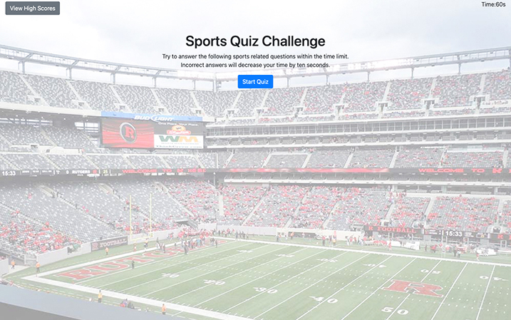

<h1 align="center"> ⚾️ Sports Quiz Challenge 🏈</h1>

### 🏠 https://crenauro.github.io/Sports-Quiz-Challenge/

 

# Install

Open the above link in your browser.
 
 

# Usage

 

Click on the blue start button to begin. Select a multiple choice answer. You need to answer all 5 questions within a 60 time frame. Each incorrect answer
decreases the timer by 10 seconds. When complete, enter your initials. The high score list is shown. Scores can be cleared and you can click the return button to return back to the start page.

 

# Description

This is a quiz with multiple choice questions.
It is built with HTML, Bootstrap CSS, and Javascript.

 
 

# Credits

Huge thanks to my tutor and AskBCS.
Background image is my own.
